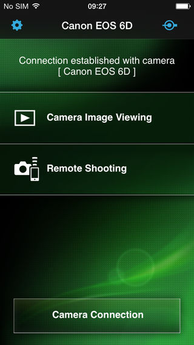

#### Wireless shooter
EOS Remote is a free application for convenient remote shooting, image browsing, and other operations on Canon EOS digital cameras with Wi-Fi functionality.
As you view live images from the camera in EOS Remote, you can remotely set the focus, adjust shooting values, and release the shutter.
You can also browse images on the camera's memory card, select images, and save them to your device.
Take EOS Remote along with your camera to enjoy photography in more ways.
#### Key Features
- Access Wi-Fi–equipped EOS cameras wirelessly over a local network connection.
- Remotely adjust shooting values on EOS cameras: Av, Tv, ISO, and exposure values.
- Remotely select AF point positions, adjust focus, and release the shutter.
- Remotely browse, delete, and rate still images and movies shot with EOS cameras.
- Save images shot with EOS cameras to your device.
- Share images for which device-specific remote viewing restrictions have been configured on EOS cameras.
- Establish a direct connection with EOS cameras in Camera access point mode, in addition to Infrastructure mode connections.

New functions for version 1.3.0
- Support for new camera model EOS M3.
- Support for importing MP4 movies. (EOS M3 only)
- Support for saving original-size JPEG images.
- Support for tablets.
- Improved camera setting function for remote shooting.

#### Compatible Cameras
Canon EOS digital cameras
- EOS 6D (WG)/(W) , EOS 70D (W) , EOS M2 (W) , EOS M3

Operating System
- iOS 6.0 - 8.1

Compatible Devices
- iPhone, iPod touch, iPad

Supported File Formats
- JPEG, RAW, and MOV, MP4 files shot with compatible cameras

#### Download
* Download from [here](https://itunes.apple.com/us/app/eos-remote/id565839396?mt=8)
  
