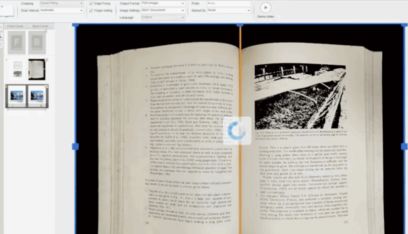

# README #
This repository shows the process of digitization of an [_incunabulae_](https://en.wikipedia.org/wiki/Incunable).

### What is this repository for? ###

* _Process-workflow-description_ turning a book and becoming a _digital asset_.
  

### How do I get set up? ###

* Summary of set up
    * Implies [hardware and software](https://bitbucket.org/imhicihu/incunnabilia-early-book-digitization/issues/1/hardware-camera-lens): camera, lens, lux control, image editors, creation of custom profiles (for optimization and a smooth workflow between hardware & software), etc.
    * Gathering of data of possible-scenarios/environment or even better: leading cases (through forums, digital libraries, bibliography, etc.). Hence, a private repository of bibliography will result an objective.
* Configuration
    * Up to now, in the process of gathering data to meet international norms. It a _mixture_ between hardware & software
* Dependencies
    * The same nature of the process, needs lots of steps to meet consecutively

### Issues ###

* Check the _original_ issues [here](https://bitbucket.org/imhicihu/incunnabilia-early-book-digitization/issues)

### Who do I talk to? ###

* Repo owner or admin
     * Contact `imhicihu` at `gmail` dot `com`

### Changelog ###

* Please check the [Commits](https://bitbucket.org/imhicihu/incunnabilia-early-book-digitization/commits/) section for the current status

### Legal ###

* All trademarks are the property of their respective owners.

### License ###

* The content of this project itself is licensed under the 
