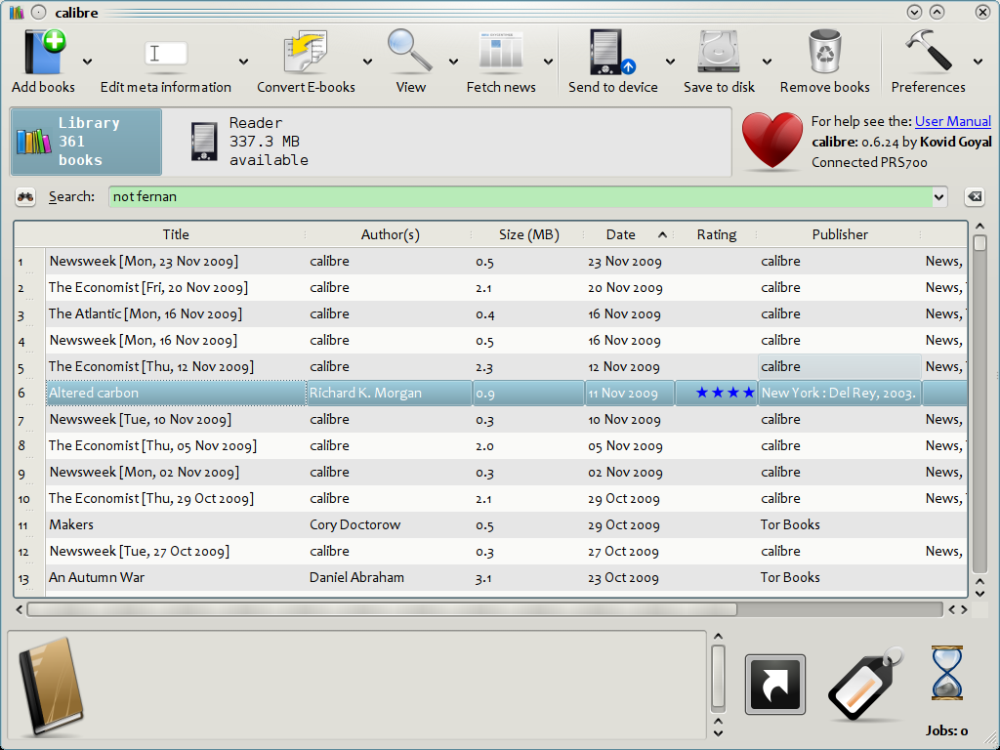
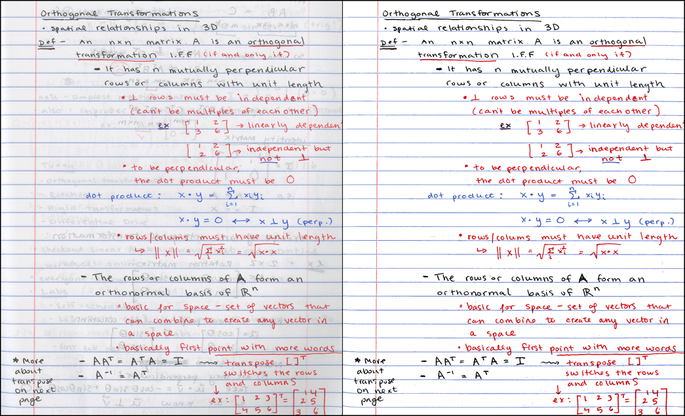

### Software

* [OpenDICE](http://www.digitizationguidelines.gov/guidelines/digitize-OpenDice.html) 
	- FADGI conformance measurement and analysis tool which has been developed as an open source alternative to the DICE (Golden Thread) system. OpenDICE is a fully functional program for the Windows operating system, created in MatLab. The analysis methodology and results obtained have been confirmed by Image Science Associates as consistent with the results obtained with DICE and Golden Thread. The results obtained with DICE, Golden Thread, and OpenDICE are only as valid as the input measurements from the targets used. Care should be taken to assure the targets are in good condition and have valid reference files. (run on Windows platform)

* [Calibre](https://calibre-ebook.com/): 
	- ebook management & digital assets
  

* [AutoSFR](http://www.digitizationguidelines.gov/guidelines/digitize-OpenDice.html):

	- This program was developed to assist imaging professionals determine the actual resolution present in images. This information assists in the determination of the appropriate scanning resolution for for specific collections. (run on Windows platform)

* [ScanTailor](http://scantailor.org/):

	- Scan Tailor is an interactive post-processing tool for scanned pages. It performs operations such as page splitting, deskewing, adding/removing borders, and others.

* [Deskew](http://galfar.vevb.net/wp/projects/deskew/):

	- Deskew is a tool for deskewing scanned text documents. Deskewing is a term used for fixing the scans to get the lines of text straight. That means rotating the image of the scanned page a little to compensate for the misalignment of the paper in the scanner.

* [smoothscan](https://github.com/ncraun/smoothscan/):

	- smoothscan is a tool to convert scanned text into a vectorized output form.

* [Book Scan Wizard](https://sourceforge.net/projects/bookscanwizard/):

	- A utility to help with Book scanning using cameras as a scanner. It will automate things such as cropping, rotating, fixing keystoning, fixing the DPI, and outputing it to tiff files that can be changed into PDF's or ebooks.

* [noteshrink](https://mzucker.github.io/2016/09/20/noteshrink.html)
  

NameMangler: rename batch files in a second!

pagedewarping

Docr - PDF scanner with document image dewarping (exclusively for the ipad)

checksum / md5: validator & securitization of digital assets

WinDjView: DJVu viewer for Windows platform

MacDjView: DJVu viewer for mac environment

Archivematica: a web- and standards-based, open-source application which allows your institution to preserve long-term access to trustworthy, authentic and reliable digital content

Omeka: Web-publishing with Dublin Core metadata add-on. Plus plugins in advance with multiple capabilities.

DIY Book Scanner Image Postprocessor: image postprocessor multi-platform

Digital Preservation Software Platform

imageJ: image processing and analysis.